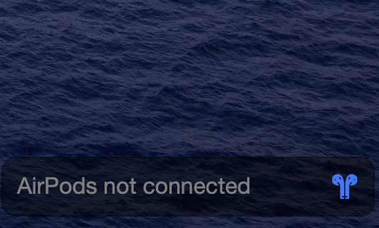

# Airpod Connection Status

Displays Uebersicht widget if AirPods are connected or not connected.

## Supported Devices

* AirPods Pro 1,2
* AirPods Max
* AirPods 1,2
* PowerBeats Pro

## For Alfred users

If you are using [AlfredApp](https://www.alfredapp.com/) with Powerpack you can install [Alfred Airpod Connector Workflow](https://github.com/Acidham/alfred-airpod-connector) to connect/disconnect your Airpod devices.

## Screenshot

